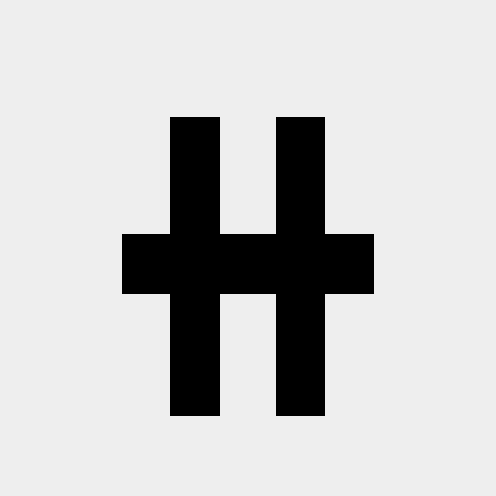

<p align="center">
  
</p>

<h1 align="center">Aegis</h1>

<p align="center">
  <strong>一个把 Coding Agent、项目文件与真实开发工作放在一起的桌面工作台。</strong>
</p>

<p align="center">
  在不丢失项目上下文的前提下，统一使用 Claude Code、Codex、Kimi Code、OpenCode、Grok、Pi 与 Qoder。
</p>

<p align="center">
  <a href="https://github.com/DylanDDeng/bubble-cowork/stargazers"></a>
  <a href="https://github.com/DylanDDeng/bubble-cowork/releases/latest"></a>
  <a href="./LICENSE"></a>
  
  
</p>

<p align="center">
  <a href="./README.md">English</a> · <strong>简体中文</strong>
</p>

Aegis 把一个本地项目目录变成可视化的 AI 开发工作台。对话、工具调用、项目文件、代码差异、终端、浏览器、权限请求、Skills 与生成结果都留在同一个工作环境中，不再散落在多个应用里。

> Aegis 目前仍是一个早期个人项目。它已经可以承担真实工作，但产品形态和部分功能仍会快速变化。

## 快速入口

- [下载最新版本](https://github.com/DylanDDeng/bubble-cowork/releases/latest)
- [核心能力](#核心能力)
- [支持的-agent-runtime](#支持的-agent-runtime)
- [本地开发](#本地开发)
- [提交 Issue](https://github.com/DylanDDeng/bubble-cowork/issues)

## 为什么做 Aegis

Coding Agent 很强，但围绕它们的工作通常是割裂的：一个窗口负责对话，一个窗口看文件，一个窗口跑终端，再打开另一个工具检查改动。Aegis 希望把这些界面收进同一个桌面环境：

- 围绕真实项目目录组织 Agent 会话。
- 在同一个输入区切换不同 Coding Agent Runtime。
- Agent 工作时持续看到文件、改动、浏览器输出、终端和生成结果。
- 在上下文中检查权限请求与工具执行过程。
- 尽可能复用本地已有的 Skills、Plugins、MCP Server、模型配置和 CLI 登录状态。

## 核心能力

- **统一使用多个 Coding Agent**：在同一界面使用 Claude Code、Codex、Kimi Code、OpenCode、Grok、Pi 与 Qoder。
- **项目目录优先的会话**：按工作目录或 Git Worktree 创建、恢复、搜索、置顶、Fork 和组织会话。
- **实时项目工作区**：浏览文件、预览常见文档、检查代码改动、Review Diff 并打开生成产物。
- **Browser 与 Design Mode**：在 Aegis 内打开项目页面、选择页面元素、附加视觉上下文，再把修改要求交给 Agent。
- **Skills、Plugins 与 MCP**：发现本地能力，并与普通提示词一起使用。
- **权限与执行控制**：选择不同 Runtime 的权限模式，在敏感操作执行前检查工具行为。
- **开发辅助界面**：在应用内使用终端、Pull Request、用量面板与定时 Automation。

## 支持的 Agent Runtime

| Runtime | 集成能力 |
| --- | --- |
| Claude Code | 本地 Runtime、Skills、Plugins、权限、用量与会话控制 |
| Codex | App Server 会话、模型、推理控制、Skills、Plugins 与 Review |
| Kimi Code | 本地 Runtime、模型、Thinking、Skills、消息队列与会话恢复 |
| OpenCode | OpenCode 会话、模型与权限控制 |
| Grok | Grok Build 会话、推理控制、Slash Command 与用量信息 |
| Pi | 通过本地 Runtime 使用 Pi Agent |
| Qoder | Qoder SDK 会话、模型与权限控制 |

Runtime 是否可用取决于对应 CLI、账号和本地配置。Aegis 会尽可能复用你已有的本地环境。

## 下载

桌面安装包发布在 [GitHub Releases](https://github.com/DylanDDeng/bubble-cowork/releases/latest)。

| 平台 | 状态 | 构建 |
| --- | --- | --- |
| macOS Apple Silicon | 主要支持 | DMG、ZIP |
| macOS Intel | 主要支持 | DMG、ZIP |
| Windows x64 | 实验性支持 | 安装版、Portable EXE |
| Linux x64 | 实验性支持 | AppImage |

### macOS 提示“Aegis 已损坏，无法打开”

目前的 macOS 构建尚未签名和公证。Gatekeeper 可能会隔离下载的应用，并显示容易误解的“应用已损坏”提示。

把 Aegis 安装到 `/Applications` 后执行：

```bash
xattr -cr /Applications/Aegis.app
```

下载新版本后可能需要重新执行一次。

### Windows 兼容性说明

Windows 安装包由 CI 自动构建，但我个人没有 Windows 电脑，因此无法保证安装流程和所有功能都能在 Windows 环境中正常运行。非常欢迎提交 Windows 相关的 Bug、修复和兼容性 PR。

## 设计灵感

我自己非常喜欢使用 Codex，尤其喜欢它的界面设计。Aegis 是我尝试学习如何设计和构建一款同样清晰、专注的应用的一次努力。因此，熟悉 Codex 的用户可能会在 Aegis 的部分界面中感受到一些相似之处。

Aegis 是一个独立的学习项目，与 OpenAI 没有从属或官方合作关系，也未获得其背书。

## 完全通过 Vibe Coding 开发

这个项目完全通过 Vibe Coding 的方式开发。它既是一个能够承担实际工作的工具，也是一次持续进行的实验：尝试与 Coding Agent 一起把想法做成真正的软件。

这也意味着项目里一定还有粗糙、不完善或值得重新思考的地方。如果你发现问题，或者对产品和代码有不同想法，非常欢迎[提交 Issue](https://github.com/DylanDDeng/bubble-cowork/issues)、发起 Pull Request，或者 Fork 仓库并按照自己的方向继续探索。

## 本地开发

### 环境要求

- Node.js 22
- npm
- 安装并登录你希望使用的本地 Coding Agent CLI

### 启动开发环境

```bash
git clone https://github.com/DylanDDeng/bubble-cowork.git
cd bubble-cowork
npm install
npm run dev
```

### 测试与构建

```bash
npm test
npm run build
```

在本地创建桌面安装包：

```bash
npm run dist
```

## 架构

Aegis 是一个 Electron 应用，由 React Renderer 与 TypeScript Main Process 组成。文件系统、终端、Git、浏览器和 Agent Runtime 等高权限操作保留在 Main Process，通过 Preload Bridge 与 IPC 暴露给 Renderer。

```text
src/
├── electron/       # Main Process、IPC、持久化与 Runtime Adapter
├── shared/         # 共享类型与通信契约
└── ui/             # React 应用与桌面工作区

scripts/            # 验证脚本、协议探测与开发工具
build/              # 应用图标与打包资源
```

主要技术包括 Electron、React、Vite、TypeScript、Tailwind CSS、Zustand 与 better-sqlite3。

## 参与贡献

欢迎提交 Issue 与 Pull Request。对于规模较大的修改，建议先发 Issue 对齐问题和方向，再开始实现。

贡献时请注意：

- 保持修改范围清晰，并说明它解决了什么用户问题。
- Runtime 与状态管理相关改动应补充或更新验证覆盖。
- 不要提交本地凭据、生成的探测报告或账号元数据。
- 使用简洁的 `<type>: <subject>` 格式编写 Commit Message。

## 许可证

Aegis 使用 [MIT License](LICENSE) 发布。

## 致谢

- [Codex](https://openai.com/codex/)：感谢它带来的产品与界面设计灵感。
- 感谢 Claude Code、Kimi Code、OpenCode、Grok、Pi、Qoder、MCP 以及整个 Coding Agent 生态中的开发者和社区。
