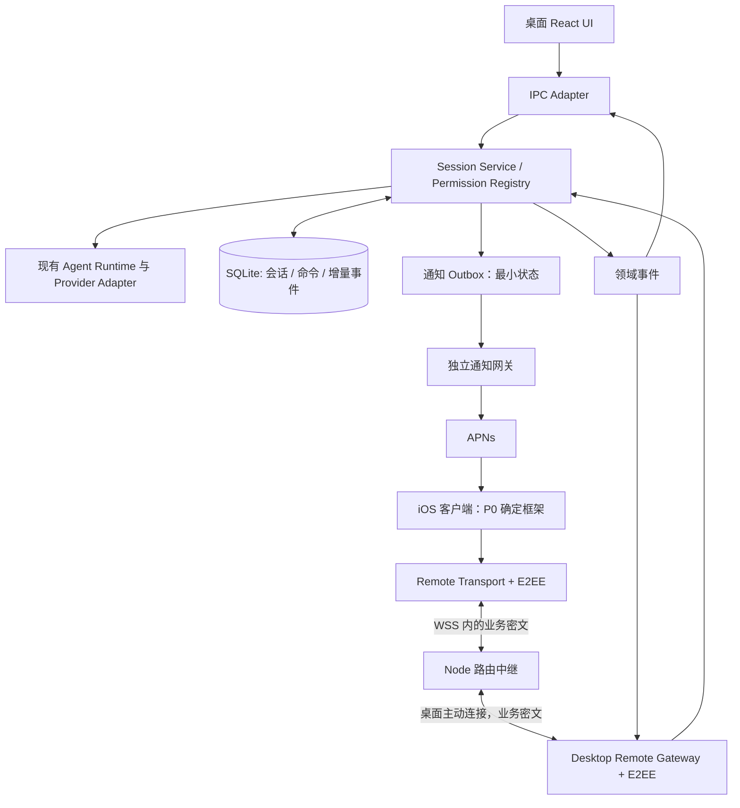

# Aegis iOS 远程伴侣设计方案

日期：2026-10-04  
状态：P0 实施中，已有 iOS 技术预览；真机验收与技术选型尚未完成  
源码基线：Aegis `4836b672`；参考版本见第 13 节及调研附录  
首发组合：iPhone + macOS Aegis；个人设备配对。iPad、Android、团队协作后续扩展。

证据附录：[Orca / Paseo 移动远程实现调研](ios-remote-orca-paseo-research.md)。本篇是当前实施方案：E2EE 从 P0 开始验证，移动技术在 P0 实机比较后确定，目录与聊天分开同步。阶段编号已重排，首版范围为 P0–P4，后续为 P5–P6。

实施记录：[iOS 技术预览与验收状态](ios-remote-implementation-status.md)。下文描述目标架构，不表示各条已实现；当前预览采用 Capacitor、加密命令日志与快照刷新，尚未完成正式业务拆分、SQLite outbox 和 TestFlight 交付。

## 1. 产品定位与核心决策

**电脑上的 Agent 在工作，用户随时可以用手机接手。**

第一版完成“发任务 → 看进度 → 回答问题/审批 → 收结果”的闭环。Agent、CLI 登录、模型密钥、Skills、MCP、项目文件继续由桌面端持有。手机同步被授权项目的会话与结果，向同一执行环境发送操作。

| 决策 | 本方案选择 | 原因与边界 |
| --- | --- | --- |
| 移动技术 | P0 比较 React + Capacitor 与 Expo / React Native，随后只保留一条产品路线 | 用相同长会话与真机比较复用成本、滚动、键盘和生命周期；业务协议不依赖 UI 框架 |
| 执行宿主 | 第一版为 Electron 主进程内的独立业务服务 | 利用现有 macOS 关窗隐藏行为；退出应用仍停止远程执行 |
| 后续宿主 | 相同业务接口迁入独立 daemon | 业务拆分先行，独立进程、监督器和安装机制后做 |
| 数据权威 | 每台机器自己的 SQLite | 手机是缓存和命令发起方，不形成第二个可任意写入的项目数据库 |
| 同步 | 目录最新值与删除标记；聊天快照、增量与分页追平；写操作独立去重 | 连接状态和内容新鲜度分别建模；首版不引入 CRDT 和全目录双向同步 |
| 网络 | 桌面与手机分别主动连接托管中继，HTTPS/WSS 443 | 支持蜂窝网络和 NAT 后的电脑，不要求端口映射 |
| 身份 | 无账户的设备配对，桌面确认授权 | 首版不引入团队、订阅和云账户；重装手机重新配对 |
| 云存储 | 不透明设备路由、路由凭据摘要、通知投递记录 | 业务授权由主机持有；中继不保存聊天历史，不持久排队执行命令 |
| 内容保护 | 首版 E2EE 保护手机与主机间的应用数据，外层继续 HTTPS/WSS | 中继只转发业务密文；设备身份、授权和帧防重放单独验证，推送内容另设最小化边界 |

## 2. 现有代码事实与改造入口

以下为源码观察，尚未对当前安装包做移动远程验收：

| 当前代码 | 现状 | 设计影响 |
| --- | --- | --- |
| `src/shared/types.ts` | 已有 `session.start/continue/history/stop`、`permission.response` 和服务端事件类型 | 可复用领域类型；远程接口需要独立白名单、运行时校验和协议版本 |
| `src/electron/ipc-handlers.ts` | 业务、runner 状态、窗口广播及权限回调集中；多个入口依赖 `BrowserWindow` | 先抽会话业务服务，IPC 与远程适配器调用同一实例 |
| `src/electron/ipc/session-windows.ts` | 事件直接广播给 Electron 窗口 | 增加领域事件出口；窗口广播变成订阅者 |
| `src/electron/libs/session-store.ts` | `sessions.db` 保存会话和消息，初始化调用 `app.getPath('userData')` | 首版沿用；后续独立宿主需注入数据目录、连接和生命周期 |
| `src/electron/main.ts` | macOS 关窗先保存编辑内容，再隐藏窗口；退出时 cleanup | 首版沿用关窗继续运行，保留显式退出行为；需实际安装包验证 |
| `src/electron/ipc-handlers.ts` 权限处理 | `pendingPermissions` 存内存，通过 `sessionId + toolUseId` resolve | 新增绑定 run/轮次的审批记录；重启后旧回调不可恢复 |
| `src/ui/store/useAppStore.ts` | 多处直接调用 `window.electron`，包含窗口/标签页状态 | 手机建立自己的轻量 store；先抽 transport 和纯渲染组件 |
| `docs/ipc-split-plan.md` | 已有按业务域拆 IPC 的计划 | 只迁移本次会话、权限、事件相关部分；其余模块按需推进 |

现有 loopback MCP/terminal HTTP 服务继续服务本机调用；不改成公网监听，也不将整个 `ClientEvent` 联合直接暴露给远端。

## 3. 第一版范围

### 3.1 必须完成

- 扫码连接一台 Mac，支持撤销手机授权；数据模型允许多机器，首版 UI 聚焦一个当前连接。
- 通过端到端加密通道同步会话、传输附件和提交操作；主机独立确认设备权限。
- 桌面选择允许远程访问的项目。手机查看项目、最近会话、运行状态和分页历史。
- 在已授权项目创建会话、继续会话，使用桌面已配置并可用的 Agent/模型。
- 查看流式回复、工具执行摘要、任务耗时、失败原因。
- 停止当前轮次；回答 Agent 问题；对当前有效权限请求批准一次或拒绝。
- 发送文本与图片；读取文本、Markdown、图片和代码 diff。
- 完成、失败、需要输入时收到 APNs 通知，点击返回正确机器和会话。
- 网络切换、锁屏、杀掉手机 App 后重新进入，恢复到桌面的真实状态。
- 手机离线可查看已缓存历史并编辑草稿；联网后由用户明确发送新草稿。

初始验收 Provider 为 Claude、Codex、Bubble，分别验证，不因统一接口存在而默认全部兼容。其他 Provider 由能力矩阵逐个启用；已有历史可以只读呈现，运行能力不足时明确显示限制。

### 3.2 后续再做

- Live Activities / 灵动岛状态、原生语音输入、系统分享扩展。
- 独立 daemon、开机启动、远程服务器执行节点。
- Android、iPad 分栏、多机器统一任务视图。
- 远程网页预览隧道、完整终端、文件编辑和代码提交。
- 账户恢复、团队访问、多人编辑和 CRDT。

第一版不直接远程操控整个桌面，不提供手机修改 API key、MCP、Shell 环境和全局权限模式的入口。Agent 本身能做什么仍由桌面运行时策略决定。

## 4. 移动端信息架构与关键交互

底部三个入口：**会话 / 项目 / 设置**。机器连接状态在顶部显示。等待处理的会话排在会话列表前部，点击直接进入对应问题或审批。

```text
┌───────────────────────────┐
│ Aegis        我的 Mac · 在线 │
│                           │
│ 待处理                     │
│ 登录页面改版      需要批准   │
│                           │
│ 最近会话                   │
│ 修复 Markdown 编辑器  运行中 │
│ 整理发布说明          已完成 │
│                           │
│                   [新任务] │
│ 会话       项目       设置  │
└───────────────────────────┘

┌───────────────────────────┐
│ ‹ 登录页面改版         ⋯    │
│ coworker · Codex           │
│                           │
│ 任务回复 / 可展开工具摘要    │
│ [查看改动：3 个文件]         │
│                           │
│ 需要批准：运行测试           │
│ 命令及所在目录              │
│ [拒绝]           [允许一次] │
│                           │
│ ＋  补充要求…        [发送] │
└───────────────────────────┘
```

- 新任务：项目 → 可用 Agent/模型 → 输入。工作目录由桌面解析项目 ID，手机不输入绝对路径。
- 正在运行：显示明确的“停止”操作；首版不支持隐式 steer/自动排队，新消息保留草稿。停止确认后才能启动下一轮。
- 两端同时发起：主机原子认领会话运行槽，先接受的启动，另一端收到 `SESSION_BUSY`，保留输入；不覆盖或悄悄合并任务。
- 审批：展示完整命令、目标路径或工具摘要；长内容展开。批准按钮只对应本次请求。桌面已处理、轮次已停止或请求过期时，手机立即更新。
- 问题：单选、多选、自由文本按实际 Provider 能力呈现，独立于工具批准。
- 网络断开：顶部显示“正在重新连接”；现有内容保持可读，停止和批准不能显示为成功。用户草稿保持可编辑。
- 连接成功但仍缺历史：显示“正在更新消息”；只有权威追平完成才显示“已同步”。消息和游标没有变化时不替换列表或重置滚动位置。
- 发送状态：`待发送 → 已被电脑接受 → 正在执行 → 完成/失败/已停止`；本地已保存或中继已收到都不等于电脑已接受。
- 操作已发出但响应丢失：显示“正在确认是否送达”，用原 commandId 查询；无法确认则保留 unknown 状态及原操作记录，不把“重试”实现为另发一条新任务。
- 视觉方向：沿用 Aegis 的主题与中性色，单列会话、简洁列表、轻量状态提示。手机布局独立，消息内容与语义尽量复用。

### 4.1 视觉参考：Paseo

用户已指定以 Paseo 为主要视觉参考。采用其克制的灰阶层次、消息排版与紧凑工作列表，并保留 Aegis 品牌及前述“会话 / 项目 / 设置”结构。视觉参考不直接决定 Capacitor 或 React Native 选型。

参考依据为 Paseo `05b074764dd1be4b7b04c7ab403ebeb88393aee3` 的主题、消息、列表和输入区源码，详细链接见 [调研附录第 5 节](ios-remote-orca-paseo-research.md#5-视觉参考与采用规则)。官方移动效果图本次未能在浏览器加载；以下是源码可确认的设计规则与 Aegis 的拟定适配，尚非像素对照或真机视觉验收。

| 维度 | Paseo 源码依据 | Aegis iOS 采用方式 |
| --- | --- | --- |
| 表面层次 | surface0–3 区分背景、容器、选中与较强层次；提供明暗及多种色调 | 首版只做随系统切换的明暗主题；背景、输入区、选中项建立稳定层次 |
| 色彩 | Zinc 灰阶与独立语义状态色；状态色较克制，diff 加减更鲜明 | 大部分界面使用中性色；品牌色用于主要操作，状态配文字/图标，避免整张彩色卡片 |
| 用户消息 | 右对齐、surface3 气泡、16 圆角，右上角较小 | 用户消息采用轻量气泡；长文本允许充分展开，图片和附件独立呈现 |
| 助手回复 | 正文容器无统一气泡背景；同组内容压缩间距 | 回复按文档阅读排版；标题、正文、工具摘要、结果形成层级 |
| 工作列表 | 圆角行、次级文字、轻量按下/选中背景 | 会话列表显示任务标题、项目、最新动作和状态；待处理分组优先 |
| 排版与尺度 | 系统字体、等宽代码字体；4/8/12/16/24 等间距 token | 中文正文以 17pt 为起点，辅助信息 13–15pt；页面边距 16pt，区块间距 24pt |
| 输入区 | 原生 dock 对接键盘位移与底部安全区 | 底部输入容器随键盘移动；图片入口和发送易触达，模型等次级设置收入选择面板 |

Paseo 的 content 字号基值为 15、列表样式 minHeight 为 36；不直接将这些值作为 Aegis 手机规格。Aegis 操作触控区域至少 44×44pt，正文支持动态字体。原型必须检查中文长段、系统大字体与暗色对比度。

### 4.2 首轮页面与状态设计

- **配对页**：简洁的连接说明、扫码入口、Mac 名称与授权范围确认；配对成功后进入会话。
- **会话首页**：待处理 → 正在运行 → 最近会话；使用列表与轻量分组，顶部显示当前 Mac，主操作为新任务。
- **会话详情**：用户气泡 + 助手正文 + 可展开工具行；回复结果就近显示文件/图片/diff 入口；向上阅读时新输出不抢滚动位置。
- **新任务面板**：先选授权项目与可用 Agent，再输入；模型作为次级选项。任务运行中保留新草稿并显示停止入口，不引入首版未支持的隐式排队。
- **审批面板**：从会话中的持久卡片展开；展示完整命令/路径，提供拒绝和允许一次，处理后保留结果记录。
- **结果预览页**：文本/Markdown/图片独立阅读，diff 默认上下排列；工具执行原文可展开但不抢占正文层次。
- **项目与设置页**：授权项目列表、设备信息、连接状态、配对管理和外观。首版远程不能改模型密钥或扩大权限模式。

状态样稿覆盖：未配对、无会话、运行中、等待输入、等待批准、成功、失败、离线缓存、正在追平和操作送达未知。连接状态放在顶部；任务状态贴近任务；“正在确认是否送达”贴近该条操作，避免用一个全局在线标识代替全部状态。

### 4.3 UI 设计在阶段中的交付

- **P0**：产出首页、会话、审批、新任务与离线状态的可点击原型；以相同视觉和长会话样本比较两种框架，冻结关键交互与首轮设计 token。
- **P1–P2**：完成共享组件规范及状态矩阵，覆盖配对、撤销、断线恢复、送达未知和审批过期；按业务协议校准文案与禁用状态。
- **P3**：完成全部首版页面、明暗主题、结果预览和真实数据交互；检查键盘、单手触控、中文换行、动态字体、VoiceOver 标签和阅读顺序。
- **P4**：使用实际安装构建对照设计稿，检查最旧支持 iPhone、安全区、长列表与滚动性能；记录缺陷与验收结果。

上述为设计约束。已有 Paseo 风格的 iOS 预览界面，并完成浏览器交互检查；尚未完成真实 iPhone 的键盘、滚动、安全区与生命周期验收。

### 配对流程

1. Mac 设置中启用“手机远程访问”，注册机器并选择可访问项目。
2. 桌面生成 2 分钟有效、一次性的配对二维码，包含协议版本、服务地址、配对 ID、桌面身份公钥和高熵临时 secret；不包含长期私钥或业务凭据。
3. 手机固定二维码中的主机身份，在加密握手内提交设备公钥、名称及配对证明。两端短确认码绑定同一握手 transcript 与双方身份；桌面确认设备与项目范围后才写入授权。
4. 手机私钥/业务凭据存 Keychain，桌面私钥存系统钥匙串，设备授权表留在主机。中继只处理独立的路由凭据，不签发主机业务权限。首次历史在认证完成后按需拉取。
5. 桌面可逐台撤销授权或关闭远程访问。撤销立即关闭连接、拒绝后续操作并清理在线手机缓存；离线手机先前已下载的内容无法保证即时远程擦除。

首版无需账户。手机丢失或重新安装，通过电脑撤销、重新配对；不提供云端找回聊天或机器授权。邀请链接不作为 App 下载推广链接使用，避免临时 secret 进入第三方分析。

## 5. 系统架构与部署



建议云实现：Node.js LTS + TypeScript + Fastify + WebSocket；PostgreSQL 只保存不透明路由、路由凭据摘要和通知投递记录。业务配对与授权在手机/主机之间的加密通道完成。通知网关经独立 HTTPS 接口接收主机明确构造的最小通知，worker 经 HTTP/2 投递 APNs；它不解密或解析业务通道。初期两个逻辑服务可共用部署与数据库，但权限、接口和日志边界独立。首个内测只部署一个中继实例，不额外引入 Redis；之后按 machineId 分片或引入跨节点路由。单实例故障期间手机断连，主机上的已启动任务继续。

移动 App 随安装包发布界面资源。Capacitor 路线打包本地 Web 资源，React Native 路线打包 JS/native 资源；前后台、Keychain、相机和推送通过所选框架的原生能力实现。APNs 默认只含状态和不透明路由 ID，不含 prompt、工具参数、代码或本地绝对路径。这些通知元数据对网关及系统推送服务可见，不属于聊天 E2EE 的保护范围。

### 三个边界

- **领域业务**：不接受 `BrowserWindow`，统一负责创建、发送、停止、审批、持久化和状态迁移。
- **宿主能力**：文件、Provider、系统钥匙串等通过接口注入；浏览器、截图、Computer Use 等需要桌面宿主的能力明确报告，不伪装为 headless 可用。
- **传输**：IPC 和 remote 都调用同一业务实例。纯窗口事件（打开标签页、聚焦窗口、布局）留在本地；远端只收到授权后的领域投影。

第一版关闭 Mac 窗口继续服务；Cmd+Q、关机、系统睡眠后远程不可用。设置提供“启用远程时保持 Mac 唤醒（接通电源）”显式选项；不承诺合盖保持运行或从睡眠远程唤醒。

独立 daemon 阶段迁走业务与数据库所有权，Electron 通过本地 socket 调用。任何阶段都只允许一个进程拥有运行调度和数据库写入职责，不能让 Electron 与 daemon 各起一套 runner。Provider 的迁移需逐个验证，不能仅移动 TypeScript 文件就宣称完成。

## 6. 远程协议

定义 `aegis.remote.v1`；完成 E2EE 与设备认证后，交换业务协议主版本、客户端版本、hostBootId、数据集 epoch 和 capability 列表。加密 framing 与业务协议分别版本化；不兼容时关闭控制并显示升级说明，不能静默降级到明文。构建版本不参与业务去重。

### 6.1 加密通道与设备认证

P0 选择有维护、有测试向量的标准协议实现与密码库，记录具体版本、密钥存储、握手身份绑定和威胁边界；例如评估成熟 Noise 实现的移动兼容性，不自行拼装 ECDH/加密函数作为产品协议。方案层规定以下契约，算法与 framing 在 P0 决策记录中冻结，P2 完成实现和审查：

- 二维码固定主机身份，授权设备必须证明持有其私钥/主机签发的凭据；主机公钥不是用户操作权限。
- 每条新物理连接创建独立加密会话，绑定双方身份、协商版本和握手 transcript，派生分方向的流量密钥。
- 认证加密帧绑定会话、方向、消息类型及有序计数器；拒绝篡改、重复帧、跨会话/方向重放，计数器不得回绕。重连后的旧业务操作只能按 commandId 进行应用层恢复。
- 中继不能代签设备权限、替换固定的主机身份或读取应用 payload；它仍可看到连接路由、IP、流量大小和时序，并可中断服务。
- 主机设备授权与中继路由授权独立；撤销立即阻止新的操作并终止已存在的设备业务会话。主机身份变更需要重新配对，不能自动信任中继提供的新密钥。
- P0 使用测试设备凭据建立真实加密链路；正式二维码、凭据轮换、撤销与负面路径在 P2 完成。没有通过加密/授权验收，不进入外部内测。

### 6.2 业务消息与接口

```ts
type RemoteCommand = {
  protocol: 'aegis.remote.v1';
  commandId: string;        // 每个操作稳定 UUID；重试沿用
  machineId: string;
  method: RemoteMethod;     // 明确白名单，不使用任意 IPC channel
  sessionId?: string;
  expectedRunId?: string;
  expectedRevision?: number;
  expiresAt: number;
  payload: unknown;         // 按 method 严格 schema 校验
};

type RemoteEvent = {
  epoch: string;            // 数据集 epoch；重建/恢复旧备份时更新
  streamId: string;         // 当前设备获准订阅的会话流，含授权代际
  seq: number;              // 该流内连续；不是模型 token 数或可见消息数
  sessionId?: string;
  runId?: string;
  revision?: number;
  type: string;
  payload: unknown;
};
```

认证的 `deviceId` 来自连接上下文，不相信 payload 的身份声明。主机启动 ID（hostBootId）与数据集 epoch 分开：普通重启不会让全部缓存失效，但会使旧运行/审批凭据失效。

| 接口 | 职责与限制 |
| --- | --- |
| `machine.describe` | 在线状态、能力、Provider 可用性、服务端时间 |
| `commands.get` | 按原 commandId 查询主机是否接受及当前结果；只允许查询本设备发起的命令 |
| `projects.list` / `sessions.list` | 只返回设备获准项目；有界快照分页，绑定同一快照水位 |
| `directory.changes/subscribe` | 目录最新值、删除标记与独立 cursor；过期回退快照 |
| `sessions.snapshot` / `sessions.history` | 权威聊天窗口；支持 tail/before/after、固定水位和分页 |
| `sessions.create` | projectId + 已配置 Provider/模型 + prompt，幂等创建 |
| `sessions.send` | 新一轮命令，检查运行槽和已知 revision |
| `sessions.stop` | 指定 runId 的停止，不能误停刚开始的下一轮 |
| `permissions.respond` | requestId + runId + hostBootId + 决策 |
| `questions.answer` | 按 schema 提交对当前问题的回答 |
| `artifacts.list/read` / `diff.read` | 只读、范围校验、分页/限大小 |
| `attachments.begin/chunk/complete` | 有界图片上传，完成校验后返回主机 attachmentId |
| `sync.subscribe/resume` | 按 sessionId 恢复聊天/运行事件流；保留窗口内有界补发 |

错误码至少包含 `UNAUTHORIZED`、`SCOPE_DENIED`、`MACHINE_OFFLINE`、`SESSION_BUSY`、`STALE_RUN`、`PERMISSION_EXPIRED`、`CURSOR_EXPIRED`、`PROTOCOL_UNSUPPORTED`、`COMMAND_EXPIRED`。UI 不展示内部堆栈或凭据。

## 7. 同步、执行与恢复语义

### 7.1 数据和事件

分两层同步，目录 cursor 与聊天 cursor 不混用：

| 数据 | 主机投影 | 手机恢复规则 |
| --- | --- | --- |
| 项目/会话列表 | 最新实体值 + 单调版本 + tombstone | 按 cursor 获取最新变化；相同实体中间更新可折叠，不要求返回的实体版本连续；删除标记过期或代际变化则重新快照 |
| 当前聊天/运行/审批 | SQLite 权威状态 + 分块消息 revision + 会话事件流 | 快照建立窗口，流更新用于即时呈现；缺口按 after 分页补齐，至 hasNewer=false 才完成追平 |

列表只传播摘要变化，不随每个 token 刷新整表；已打开会话订阅详细内容，后台会话保留目录状态和通知所需数据。目录分页固定快照版本；游标包含数据集与设备授权代际，范围变化时不能沿用旧授权快照。

已有 messages/sessions 是权威记录；新增表名为建议：

- `remote_devices`：设备授权、范围、吊销状态；长期 secret 本体进钥匙串。
- `remote_commands`：`device_id + command_id` 唯一键、payload hash、状态、结果、关联 run。
- `session_runs`：runId、会话、Provider、状态、开始/结束、最后检查点。
- `permission_requests`：requestId、runId、hostBootId、状态、决定与决定来源；运行中的 resolver 仍只在内存。
- `remote_outbox`：与持久业务状态同事务提交的事件，以及通知待投递记录。
- `remote_directory`：目录最新实体、版本及删除标记；由 outbox 构建设备可见变化和游标。
- `remote_feed`：按设备与会话生成的授权流、seq、保留时间；以 streamId + outboxId 去重，保证投影重试不重复。

领域事件先持久化再发出。现有每个 streaming token 不逐条持久化：约 100–250ms 合并成消息块更新，单调 `messageRevision`，按块替换/更新。权限、停止和最终状态立即落盘并发出；终态必须覆盖最后一次文本检查点。崩溃最多丢失尚未落盘的末尾块，不把它标记为完整结果。

聊天快照采用固定水位：在同一 SQLite 读事务取得当前状态与 outbox 水位 W；事件投影处理到 W 后，定位该流水位不大于 W 的最后一个游标 C，不能直接取当时最新游标。并发新事件进入 C 之后。历史分页绑定 snapshot/revision，避免分页期间把不同版本拼接。客户端处理事件与保存 cursor 在同一个本地事务内完成。

每个聊天 feed 仅包含该设备所订阅会话的授权数据，seq 连续可检测丢包；不能把全局事件过滤后仍要求手机看到连续全局 seq。授权范围变化更新设备授权代际与 streamId，清除撤销项目缓存并重新获取快照；全局数据集 epoch 不因此改变。快照/流结果携带连接与订阅 generation，旧连接的晚到结果不能覆盖新状态。

建议增量保留 7 天且每设备上限 50MB，任一达到即清理最旧事件；历史仍保存在现有消息库。超出保留窗口返回 `CURSOR_EXPIRED`，重新快照而非猜测补齐。具体限额在性能验证后调整。

聊天分页明确区分 `tail`（最近窗口）、`before`（向上加载）和 `after`（追平缺口）。after 的一次响应未到水位时返回 hasNewer/endCursor，继续请求直到完整；消息块合并后保留其源 seq 范围，不用显示项数量计算 cursor。游标过期、历史回退或 epoch 改变时原子安装新窗口，旧历史仍可向上翻页。

连接状态为 `connecting / connected / offline`，每个会话的新鲜度独立为 `cached / catching_up / current / error`。current 表示已达到最近一次主机确认的水位，不代表冻结未来更新。同 epoch/revision 的响应只更新同步记账，不重建消息数组；未知操作的本地草稿/待确认展示独立于权威历史，避免重复气泡。

### 7.2 幂等与无法确定的执行结果

- 主机接收命令后，在事务内创建命令记录、用户消息/运行记录和 outbox，再返回 `accepted`。`accepted` 只表示主机持久接受。
- 同一 commandId 重传返回已有状态；同 ID 不同 payload 拒绝。桌面端操作也经过统一业务入口，避免绕过并发约束。
- 重试分三类：读取可有界重试；订阅在新连接重建并核对新服务端 subscriptionId；写操作仅在稳定 commandId + 主机去重记录支持下重试。禁止在网络重试时生成新业务 ID。
- 内部 worker 认领 accepted 命令并调用 Provider；会话启动认领串行，长时间运行不占住停止/审批的控制锁。
- 外部 Provider 启动与 SQLite 无法组成原子事务。崩溃发生在“已提交给 Provider、尚未记录成功”之间时，查询 Provider 状态；不能确认则标为 `interrupted/unknown`，要求用户显式继续，不自动重新执行有副作用的任务。
- 手机发送后断线：重连用原 commandId 查询，必要时在有效期内重发同一命令。中继不存离线执行队列；主机明确未接受的过期操作不自动重发。
- 去重记录默认保留 30 天并保留运行关联。新执行命令有效期默认 5 分钟；首次接受后以主机记录为准。过期未见命令拒绝，不能在去重记录清理后当作新命令执行。
- 有效期以主机时间判断，手机通过握手估算时差；时差不可信时重新握手。工具审批还必须满足其请求有效期与轮次身份，不因一般命令有效期尚未到达就允许通过。

### 7.3 运行与审批

运行状态建议规范化为 `accepted / starting / running / waiting_input / stopping / completed / failed / stopped / interrupted`。连接在线与运行状态分别建模，手机断线不能把运行标成失败。

权限请求身份使用 `sessionId + runId + requestId + hostBootId`，并记录 Provider 的 toolUseId 映射。两端处理通过同一 PermissionRegistry 做条件更新，第一条有效决定生效；后到达端看到“已在另一设备处理”。

停止、运行结束、授权撤销或宿主重启会使相关待审批记录失效。重启后内存 resolver 消失，数据库记录只能用于历史，不能重新批准。Provider 如能恢复运行，必须重新生成有效审批身份。

首版手机只允许一次性工具授权，不远程扩大整个会话的权限。停止命令使用独立控制通道/优先队列，并验证 runId；网络不可达时显示“尚未送达”，不能显示“已停止”。

## 8. 文件、权限与数据边界

- 手机通过 projectId/artifactId 访问文件；主机解析真实路径并检查根目录归属、symlink、文件类型及大小。拒绝路径穿越和任意绝对路径读取。
- 授权范围控制远程 API 暴露的数据与操作；它不是 Agent Shell 的文件系统沙箱。Agent 的实际访问边界继续由现有 Provider 权限与 OS 决定，不能向用户承诺仅凭项目选择就限制全部工具访问。
- 第一版文本预览建议上限 1MB，diff 上限 2MB，单图上传上限 10MB；超限提供摘要或“回到电脑查看”。分块上传应校验总长度、哈希、MIME、图片解码结果并清理未完成临时文件。
- 图片分块在端点加密，由中继有界转发到桌面附件存储，主机解密后校验内容，不新建永久云端对象存储。文件发送只引用已完成且属于设备授权范围的 attachmentId。
- HTML 不在带原生桥接的主 WebView 中直接执行。第一版提供源码/静态预览或显示暂不支持；网页远程预览隧道后续单独设计。
- 不直接广播完整桌面事件：移除 API key、登录信息、内部配置、无关会话和窗口状态。正文中用户/Agent 自己包含的敏感内容属于所授权的会话数据，不能承诺自动识别并完全消除。
- 中继路由 token 按机器/设备隔离、可吊销，建议短期 access token 15 分钟；它只允许建立转发路径。业务身份在 E2EE 内由主机验证，长期设备凭据在 Keychain，轮换由主机签发。配对与敏感操作限流，不以中继准入代替主机授权。
- 日志仅记录 requestId、错误码、字节量、延迟和匿名路由 ID，不写 prompt、附件、token 或工具参数。移动缓存按设备分区，退出配对时清理；原生数据保护和锁屏行为必须实机验证。

## 9. 通知与 iOS 生命周期

主机在任务完成/失败/需要输入时产生通知事件，与业务状态一起进入 outbox。独立通知网关按 eventId 去重写入最小通知的投递记录，主机得到“通知已持久接收”后才清理待投递项。后台 worker 有界重试 APNs，移除失效 token；转发中继不通过解密聊天推导通知。

通知只作为提醒。手机进入后台不承诺 WSS 常驻，也不依靠 silent push 维持执行。回到前台必须重新认证/重连/补事件，并核对待审批请求是否仍有效。

回前台对“看似仍在线”的连接立即进行应用层探测，初始预算 3 秒；健康则沿用，超时则重连。恢复订阅后仍等待权威追平才标记 current。心跳提供 presence 和通知抑制信号，不能因手机不在前台就错误丢弃其已订阅业务数据；取消订阅由显式生命周期管理。

- 同一审批 requestId 只形成一个逻辑提醒，状态变化可更新/取消通知，但不保证已送达的系统横幅可立即收回。
- APNs 接受不等于用户已经收到或阅读。通知延迟/丢失不改变任务状态；App 进入前台主动拉取待处理列表。
- 首版通知点击打开 App；不做锁屏一键批准。Live Activities 为后续增强，不能成为任务执行的必要依赖。
- 配对撤销后停止通知投递，深链进入已撤销设备时清除本地授权入口。
- 非关键完成通知重连补投默认只追溯 15 分钟；仍有效的待审批可以补发。避免电脑恢复网络时集中推送几天的旧消息。

## 10. 建议代码组织与迁移顺序

以下均为拟新增路径，不代表已经存在；第一版保留现有根包布局，不顺带重构整个仓库为 monorepo。

```text
src/shared/remote/
  protocol.ts             # schemas、版本、错误码、capabilities
  session-view.ts         # 远端可见 DTO 和状态归一化
  secure-channel.ts       # 成熟协议实现的适配接口；算法/版本由 P0 冻结
src/electron/services/
  session-service.ts      # IPC/remote 共用领域入口
  permission-registry.ts
  session-event-bus.ts
src/electron/remote/
  gateway.ts              # 桌面主动连接、认证、重连
  command-router.ts       # 白名单、授权、幂等
  sync-store.ts           # outbox、目录投影、会话 feed、snapshot
src/ui/platform/
  session-client.ts       # 界面使用的接口
  electron-session-client.ts
src/ui/shared/            # 仅 Web 路线复用 DOM 组件；RN 复用纯逻辑/类型
apps/mobile/
  src/app/                # 会话、项目、设置及移动导航
  src/platform/           # RemoteSessionClient、缓存、原生能力
  ios/                    # P0 选定路线对应的原生工程、推送与插件
services/relay/
  src/                    # 配对、鉴权、路由、通知 worker
  migrations/
```

共享源码在移动构建中只通过明确纯模块入口导入；CI 检查不引入 Electron、Node fs、桌面 preload。后续如确需独立 packages，再提取已经稳定的协议与 UI 边界。

先让 ElectronSessionClient 保持现有行为，再增加 RemoteSessionClient。不要为了兼容旧组件在手机伪造一个无限权限的 `window.electron` 对象。

## 11. 实施阶段与验收

**首版交付范围为 P0–P4，终点是可安装、可远程使用的 TestFlight 内测版。P5–P6 属于后续演进，不阻塞首版。** 各阶段按顺序验收；前一阶段的验证结论进入下一阶段设计，不能用完成界面代替连接、执行与恢复的验收。

| 阶段 | 核心目标 | 主要交付物 | 退出条件 |
| --- | --- | --- | --- |
| P0 技术验证与选型 | 证明手机能安全控制现有运行时，并选定移动技术 | 最小业务接口、加密远程样例、两种 UI 小样、技术决策记录 | 真实 iPhone 蜂窝网络完成发送、流式回复、审批、停止；选定一个移动框架与加密协议实现 |
| P1 桌面业务底座 | 让桌面和手机共用同一套执行与持久化逻辑 | SessionService、PermissionRegistry、领域事件、命令/运行/outbox 基础 | 桌面功能回归通过；无重复 runner；关窗后业务继续，停止/审批不被长任务阻塞 |
| P2 安全连接与可靠同步 | 保证身份可信、状态可恢复、重试不重复执行 | 正式配对与撤销、E2EE、目录与聊天同步、命令恢复 | 断网、ACK 丢失、重启、重复投递、权限撤销等故障场景符合协议；负面安全用例通过 |
| P3 手机产品闭环 | 用户能独立在手机完成日常远程任务 | 会话/项目/设置、审批与问题、图片、结果预览、缓存与草稿 | 已授权项目内完成新建到收结果；三类 Provider 按能力矩阵验证；网络切换和两端竞争行为清楚 |
| P4 TestFlight 内测交付 | 把功能变成可安装、可恢复、可提醒的真实产品 | APNs、深链、签名包、内测分发、真机验收记录 | TestFlight 安装成功；锁屏/杀 App 后通知与恢复有效；与实际安装的 Mac 构建联调通过 |
| P5 独立执行宿主 | 桌面界面退出后，受支持的后台任务仍能继续 | daemon、本地 socket、监督/启动机制、迁移与回滚 | 数据库与 runner 始终单一所有者；升级回滚不重复执行；明确桌面依赖能力的限制 |
| P6 扩展体验与平台 | 按真实需求扩展设备与交互 | 多机器、Live Activities、iPad/Android 等独立增量 | 每项单独定义能力、版本兼容与验收，不把所有扩展绑定成一次大交付 |

### P0：先证明路线可行

- 从一个当前可用 Provider 抽出最小 SessionService 接口，完成“手机 → 加密中继 → Mac → Agent → 手机”的单会话闭环；本阶段不推定所有 Provider 都兼容。
- 使用短期测试设备凭据、固定主机身份、TLS + E2EE 和明确项目范围。首个公网请求就校验身份与权限；不部署未认证的测试控制入口。
- 为 Capacitor 与 Expo / React Native 各做一个有限小样，用同一份长会话数据比较滚动、键盘、输入、前后台恢复和代码复用成本。共用协议测试条件，比较后只保留一条产品路线。
- 真机验证蜂窝网络发送、流式输出、一次审批与停止；Mac 隐藏窗口后继续执行。记录设备、OS、构建版本、网络与数据规模。
- 输出框架选择、具体加密协议/库及版本、握手与设备授权边界、能力契约、测量结果和更新后的排期。标准协议实现无法满足移动兼容性时继续解决该阻塞，不降级成明文或自创协议。

**完成标准：有可复现的实机闭环和明确技术决策。P0 样例不等于完整产品，也不等于已完成安全审计。**

### P1：抽出桌面业务底座

- 提取 SessionService、PermissionRegistry 与事件总线，让 IPC 和远程入口调用同一业务实例；领域服务不再依赖窗口对象。
- 将命令记录、运行槽认领、用户消息与 outbox 纳入明确的 SQLite 事务边界；补齐稳定 commandId、payload 校验及最小去重机制。
- 停止/审批走优先控制路径，避免等待整个 Provider 调用结束；保持一套 runner 和一个数据库写入所有者。
- 建立 Claude、Codex、Bubble 的能力矩阵，记录启动、续聊、停止、审批、问题及恢复限制；回归桌面已有流程。

**完成标准：抽取后桌面功能可用，关窗不影响执行，两端调用共享并发与权限规则；远程适配器无需复制现有业务。**

### P2：完成安全连接与可靠同步

- 完成正式二维码配对、主机身份固定、设备授权、项目范围、凭据轮换与撤销，包括可用的基础配对界面。P3 只完善体验，不推迟此处的安全闭环。
- 完成 E2EE 生命周期、防重放、版本绑定、拒绝明文降级和主机身份变化处理；审查所选实现及集成方式。
- 实现目录最新值/tombstone 与聊天快照/增量/分页追平；区分连接状态和同步状态，隔离旧连接、旧授权代际与旧快照的晚到响应。
- 完成持久命令记录、断线查询与同 ID 重试；Provider 接受与本地落盘之间崩溃时保留 unknown/interrupted，不盲目重跑。审批和停止绑定实际 run 身份。
- 对 ACK 丢失、重复消息、乱序返回、游标过期、主机重启、授权撤销和跨会话隔离注入故障并验证。

**完成标准：电脑状态始终是权威；连接恢复后能追平，未知执行结果不会伪装成功或触发重复任务；加密与授权负面用例通过后才可进入外部内测。**

### P3：完成手机产品闭环

- 在选定框架上实现会话、项目、设置三个入口，完善配对/撤销体验与连接反馈。
- 支持新建/续聊、进度、审批、回答问题、停止、图片上传、文本/Markdown/图片/diff 预览。
- 实现离线可读缓存、草稿、unknown 操作状态；联网不自动发送新草稿。长内容、键盘、安全区、触控与系统字体缩放在真机检查。
- Claude、Codex、Bubble 分别按能力矩阵验收；不支持的操作展示具体原因。验证桌面与手机同时发送/批准，以及 Wi-Fi 与蜂窝网络切换。

**完成标准：用户在一台已配对 Mac 的授权项目内，可仅用手机完成“发任务 → 看进度 → 处理请求 → 收结果”，并能理解离线、追平和失败状态。**

### P4：交付 TestFlight 内测版

- 完成通知 outbox、持久投递去重、APNs token 生命周期和最小通知 payload；点击深链后重新验证当前会话与审批。
- 完成 iOS 签名、安装与 TestFlight 分发；使用实际打包安装的 macOS Aegis 联调，记录两端精确构建版本。
- 验证锁屏、后台暂停、杀 App、断网再恢复，以及通知延迟/丢失；手机不在线时电脑继续执行，回前台主动恢复数据。
- 测量最旧支持设备上的滚动、峰值内存、恢复耗时、网络流量与耗电，确定支持版本及发布阈值，修复阻塞问题。

**完成标准：测试用户能安装并完成真实远程闭环，关键故障用例与性能门槛有记录。此阶段交付 TestFlight 内测，不包含公开 App Store 上架承诺。**

### P5–P6：首版之后逐项演进

P5 将业务、数据库和运行调度迁入独立 daemon；Electron 改为本地 socket 客户端。提供进程监督、启动与迁移/回滚机制，验证桌面退出后兼容的后台任务继续。需要桌面交互、截图或 Computer Use 的能力必须单独声明依赖，不能统一承诺 headless 可用。

P6 按内测反馈拆成独立增量：先评估多机器与状态提醒，再评估 iPad/Android、语音和分享扩展；远程网页预览、终端及文件编辑另立权限与恢复设计。账户/团队/CRDT 仍需独立立项，不因预留数据结构就视为已经承诺。

### 跨阶段关键验收用例

1. 两端打开同一会话，手机发送后桌面同步显示，Agent 最终结果一致。
2. 桌面正运行时手机打开，获得正确快照并接上后续增量；另一会话输出不串入。
3. RPC/WS 断在主机接受前、接受后、返回 ACK 前，重试同 commandId 均不产生重复轮次；同 ID 不同 payload 被拒绝。
4. Stop 不被长时间 Provider await 或大附件阻塞；旧 run 的 Stop 不影响新 run。
5. 桌面批准与手机批准竞争、批准与 Stop 竞争、重启后点旧通知，只有有效请求可继续执行。
6. 手机后台/被杀后电脑继续工作；重新启动手机补齐消息，APNs 不可用时仍可看到结果。
7. 快照生成时并发来新消息；事件重复、乱序、保留窗口过期；最终状态无缺口且无重复正文。
8. 主机从旧备份恢复产生新数据集 epoch；手机旧 cursor 不覆盖或跳过主机现状。
9. 项目撤销、配对撤销、路径穿越与 symlink 逃逸、其他设备 attachmentId 均被拒绝。
10. Claude/Codex/Bubble 各完成新建、续聊、停止、一次审批、重启恢复边界验收；不支持的能力显示原因。
11. 1000 条会话摘要分页、至少 500 轮混合工具/Markdown 的历史按需加载；在最旧支持 iPhone 上检查滚动、内存和恢复耗时。
12. 使用真实打包安装的 Aegis 与 iOS App 验证，源码测试、浏览器预览和模拟器不能代替最终验收。
13. 拒绝篡改密文、重复帧、跨会话/方向重放、错误主机身份、未授权设备及协议降级；撤销后旧连接无法继续操作。
14. 目录删除通过 tombstone 生效，删除标记过期后全量恢复不复活旧项；项目范围变化清理缓存并作废旧响应。
15. 历史 after 跨多页持续追平至 hasNewer=false；中途断线可恢复，旧页晚到不覆盖新窗口；同 revision 不重建列表或跳滚动位置。
16. 连接恢复后重新认证并重建逻辑订阅；socket 在线但未追平时仍显示“正在更新消息”。
17. Provider 已接受但本地成功记录未落盘时杀进程；恢复后查证或标记 unknown/interrupted，不自动开启第二次有副作用执行。

建议性能目标：在 RTT ≤150ms 的受控网络下，主机持久接受命令 P95 ≤1s（不含模型响应），流更新可见延迟 P95 ≤500ms，网络恢复后会话追平 P95 ≤5s（限定增量 ≤1MB）。这些是待测目标，P0 应记录设备、网络、数据量及实测结果；Apple 推送不设无法控制的硬到达 SLA。

## 12. 工作量、交付边界与下一步

粗估为 1 名熟悉当前仓库的工程师完成 P0–P4 约 **7–11 个工程周**：P0 约 1–2 周、P1 约 2 周、P2 约 2–3 周、P3 约 1–2 周、P4 约 1–2 周。P5/P6 不计入；外部账号开通、TestFlight 审核等等待不计入。这是规划区间，P0 后按业务耦合、协议兼容性和实机结果重新估算。

主要不确定性是 `ipc-handlers.ts` 中业务与窗口依赖的拆分、各 Provider 的恢复语义、移动框架的长会话表现，以及成熟加密协议实现的移动兼容性。中继成本主要随连接数、消息/图片带宽和日志增长；先记录 10–20 台测试设备的负载再选正式容量，不提前承诺固定月费。

P0 实机验证需要可用的 iOS 开发签名环境、测试 iPhone、Mac 和带 TLS 的测试中继环境；进入 P4 前需要就绪的 Apple Developer Team、Bundle ID、APNs 凭据和 TestFlight 配置。当前文档修订不代表已具备这些外部条件，也不代表已经部署或提交商店。

当前正在实施 P0：最小业务接口、加密链路与 Capacitor 技术预览已落地；下一步需要框架实机比较及真实 Provider 的单会话闭环。先用结果冻结路线，再开展 P1–P4，不能将预览已具备的部分配对和界面能力计为后续阶段验收完成。

## 13. 参考项目与采用边界

Lody 固定参考版本为 `f5ebb43fec780e3710cee39c4471d3a40d96daa4`，以下为静态源码证据：

- [daemon watchdog](https://github.com/LodyAI/Lody/blob/f5ebb43fec780e3710cee39c4471d3a40d96daa4/apps/cli/src/commands/daemon-runner.ts)：借鉴独立执行宿主与监督机制，Aegis 推迟到 P5。
- [Session dispatch watcher](https://github.com/LodyAI/Lody/blob/f5ebb43fec780e3710cee39c4471d3a40d96daa4/apps/cli/src/session/session-dispatch-watcher.ts#L219)：借鉴送达/执行分离、持久恢复与重复派发处理；Aegis 首版采用主机命令日志而非多写入 CRDT。
- [Workspace writer](https://github.com/LodyAI/Lody/blob/f5ebb43fec780e3710cee39c4471d3a40d96daa4/packages/components/src/providers/workspace-writer-impl.ts)：借鉴统一写入口，但不照搬所有客户端可写的存储语义。
- [Native platform](https://github.com/LodyAI/Lody/blob/f5ebb43fec780e3710cee39c4471d3a40d96daa4/packages/components/src/lib/native-platform.ts)：共享 React UI 与 Capacitor 环境适配。
- [Public boundary](https://github.com/LodyAI/Lody/blob/f5ebb43fec780e3710cee39c4471d3a40d96daa4/scripts/check-public-boundary.mjs)：完整移动工程与后端未包含在公开仓库中，不能将其当成可直接部署的完整远程产品模板。

Orca 与 Paseo 的固定版本及逐项源码链接见 [调研附录](ios-remote-orca-paseo-research.md)。本修订采用以下边界：

- Orca：借鉴端点身份绑定、加密帧防重放、订阅恢复、结构化操作身份与未知送达状态；不将 PTY 输入当作 Aegis 的主要控制协议。
- Paseo：借鉴统一业务客户端、目录最新值/tombstone、聊天实时流与权威分页追平、连接与内容状态分离；Aegis 继续以 SQLite 为权威，不照搬内存历史或旧兼容鉴权分支。
- 三个项目：执行留在主机，手机作为受授权入口；公开源码与文档不等于已经验证线上服务。框架选择仍以 P0 在 Aegis 场景下的实机结果为准。

以上是架构借鉴，本方案不复制这些项目源码；未来如复用代码，按实际文件许可证保留所需声明。
